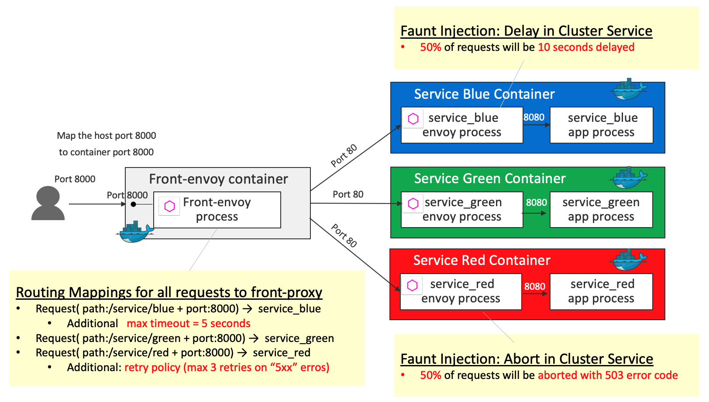

# Timeouts and Retries

Envoy allows retries to be configured both in the [route configuration](https://www.envoyproxy.io/docs/envoy/v1.5.0/api-v2/rds.proto#envoy-api-msg-routeaction-retrypolicy) as well as for specific requests via [request headers](https://www.envoyproxy.io/docs/envoy/v1.5.0/configuration/http_filters/router_filter#config-http-filters-router-headers). The demo here shows how to configure request timeouts and retries using the envoy route configuration.

## Demo Overview



Front proxy configurations in this demo are the same as the ones in [HTTP Routing: Simple Match Routing](../httproute-simple-match) except the following two additional behaviors:
- `Timeouts` (5 seconds) for the request to `service_blue`
- `Retries` that Envoy will attempt to do if `service_red` responds with any 5xx response code

For Service Containers in the demo, `delay` fault injection and `abort` fault injection are configured in `service_blue` and `service_red` respectively (which are the same configuration as the ones in [Fault Injection Demo](../fault-injection))

Key definition - `virtual_hosts` in [front-envoy.yaml](front-envoy.yaml)
```yaml
    virtual_hosts:
    - name: backend
        domains:
        - "*"
        routes:
        - match:
            prefix: "/service/blue"
        route:
            cluster: service_blue
            timeout: 5s
        - match:
            prefix: "/service/green"
        route:
            cluster: service_green
        - match:
            prefix: "/service/red"
        route:
            cluster: service_red
            retry_policy:
              retry_on: "5xx"
              num_retries: 3
              per_try_timeout: 5s
```
> - `timeout`: (Duration) Specifies the timeout for the route. If not specified, the default is 15s. For more detail, see`timeout`section in [RouteAction](https://www.envoyproxy.io/docs/envoy/v1.5.0/api-v2/rds.proto#routeaction)
> - `retry_policy` indicates the retry policy for all routes in this virtual host. For more detail on retry_policy, see [route.RetryPolicy](https://www.envoyproxy.io/docs/envoy/v1.5.0/api-v2/rds.proto#envoy-api-msg-routeaction-retrypolicy)
>   - `retry_on`: it's retry condition by which the Envoy can retry on different types of conditions depending on application requirements. For example, network failure, all 5xx response codes, idempotent 4xx response codes, etc.
>   - `num_retires`: Maximum number of retries. Envoy will continue to retry any number of times. An exponential backoff algorithm is used between each retry.


## Getting Started
```sh
git clone https://github.com/yokawasa/envoy-proxy-demos.git
cd envoy-proxy-demos/timeouts-retries
```
> [NOTICE] Before you run this demo, make sure that all demo containers in previous demo are stopped!

## Run the Demo

### Build and Run containers

```sh
docker-compose up --build -d

# check all services are up
docker-compose ps --service

front-envoy
service_blue
service_green
service_red

# List containers
docker-compose ps

              Name                            Command               State                            Ports
-----------------------------------------------------------------------------------------------------------------------------------
timeouts-retries_front-envoy_1     /docker-entrypoint.sh /bin ...   Up      10000/tcp, 0.0.0.0:8000->8000/tcp, 0.0.0.0:8001->8001/tcp
timeouts-retries_service_blue_1    /bin/sh -c /usr/local/bin/ ...   Up      10000/tcp, 80/tcp                                        
timeouts-retries_service_green_1   /bin/sh -c /usr/local/bin/ ...   Up      10000/tcp, 80/tcp                                        
timeouts-retries_service_red_1     /bin/sh -c /usr/local/bin/ ...   Up      10000/tcp, 80/tcp
```

### Access each services

Access serivce_blue and check if 50% of requests to service_blue are timeout error (over 5 seconds timeout error with 504 status code). The following helper command allow you to send requests repeatedly (For example, send 10 requests to http://localhost:8000/service/blue).

```sh
../helpers/send-requests.sh http://localhost:8000/service/blue 10

Sending GET request: http://localhost:8000/service/blue
504
Sending GET request: http://localhost:8000/service/blue
504
Sending GET request: http://localhost:8000/service/blue
504
Sending GET request: http://localhost:8000/service/blue
200
Sending GET request: http://localhost:8000/service/blue
200
```

Access serivce_blue and check if green background page is displayed. It is expected that nothting special will occur

```sh
curl -s http://localhost:8000/service/green
```

Access serivce_red and check if most of requests to service_red are ok (200 status code), but seldomly you'll get abort error (503 status code). To explain what happens behind the senene, 50% of requests to  `service_red` will be aborted with 503 error code due to the fault injection config in service_red, however the request will be recovered by the front proxy's retry mechanism, which is why most of the requests to service_red tuned out to be ok (200 status code). The following helper command allow you to send requests repeatedly (For example, send 10 requests to http://localhost:8000/service/blue)

```sh
../helpers/send-requests.sh http://localhost:8000/service/red 10

Sending GET request: http://localhost:8000/service/red
200
Sending GET request: http://localhost:8000/service/red
200
Sending GET request: http://localhost:8000/service/red
200
Sending GET request: http://localhost:8000/service/red
503
Sending GET request: http://localhost:8000/service/red
200
Sending GET request: http://localhost:8000/service/red
200
Sending GET request: http://localhost:8000/service/red
200
Sending GET request: http://localhost:8000/service/red
200
Sending GET request: http://localhost:8000/service/red
200
Sending GET request: http://localhost:8000/service/red
200
```

The example run above shows 503 status code one time out of 10 requests, however as explained above this isn't what actually occured. Let's see what it was like with `docker-compose logs`:

```
docker-compose logs -f

service_red_1    | [2020-08-13T22:58:42.619Z] "GET /service/red HTTP/2" 200 - 0 148 1 1 "-" "curl/7.54.0" "c381450e-b8f9-4b06-9b08-adab5bbb5b87" "localhost:8000" "127.0.0.1:8080"
service_red_1    | [2020-08-13T22:58:43.645Z] "GET /service/red HTTP/2" 200 - 0 148 2 1 "-" "curl/7.54.0" "fd67460c-a332-4510-8b78-fc870a8db246" "localhost:8000" "127.0.0.1:8080"
service_red_1    | [2020-08-13T22:58:44.671Z] "GET /service/red HTTP/2" 503 FI 0 18 0 - "-" "curl/7.54.0" "0e89d112-3e53-4c23-8360-83d8debc8b14" "localhost:8000" "-"
service_red_1    | [2020-08-13T22:58:44.688Z] "GET /service/red HTTP/2" 200 - 0 148 2 2 "-" "curl/7.54.0" "0e89d112-3e53-4c23-8360-83d8debc8b14" "localhost:8000" "127.0.0.1:8080"
service_red_1    | [2020-08-13T22:58:45.714Z] "GET /service/red HTTP/2" 503 FI 0 18 0 - "-" "curl/7.54.0" "536e2d42-92fb-4146-833d-8501ed859d04" "localhost:8000" "-"
service_red_1    | [2020-08-13T22:58:45.729Z] "GET /service/red HTTP/2" 503 FI 0 18 0 - "-" "curl/7.54.0" "536e2d42-92fb-4146-833d-8501ed859d04" "localhost:8000" "-"
service_red_1    | [2020-08-13T22:58:45.755Z] "GET /service/red HTTP/2" 503 FI 0 18 0 - "-" "curl/7.54.0" "536e2d42-92fb-4146-833d-8501ed859d04" "localhost:8000" "-"
service_red_1    | [2020-08-13T22:58:45.755Z] "GET /service/red HTTP/2" 503 FI 0 18 0 - "-" "curl/7.54.0" "536e2d42-92fb-4146-833d-8501ed859d04" "localhost:8000" "-"
service_red_1    | [2020-08-13T22:58:45.779Z] "GET /service/red HTTP/2" 200 - 0 148 2 1 "-" "curl/7.54.0" "536e2d42-92fb-4146-833d-8501ed859d04" "localhost:8000" "127.0.0.1:8080"
service_red_1    | [2020-08-13T22:58:46.805Z] "GET /service/red HTTP/2" 200 - 0 148 3 2 "-" "curl/7.54.0" "c84a1945-f342-43a2-bb72-27a3dcc25ab6" "localhost:8000" "127.0.0.1:8080"
service_red_1    | [2020-08-13T22:58:47.826Z] "GET /service/red HTTP/2" 200 - 0 148 2 1 "-" "curl/7.54.0" "7700a887-d419-4f9f-965d-107504007a6c" "localhost:8000" "127.0.0.1:8080"
service_red_1    | [2020-08-13T22:58:48.853Z] "GET /service/red HTTP/2" 200 - 0 148 1 1 "-" "curl/7.54.0" "9f3a2717-83da-495f-8115-159a02854446" "localhost:8000" "127.0.0.1:8080"
service_red_1    | [2020-08-13T22:58:49.881Z] "GET /service/red HTTP/2" 503 FI 0 18 0 - "-" "curl/7.54.0" "664deb97-c446-464c-82c0-ad5f4ed2c8d1" "localhost:8000" "-"
service_red_1    | [2020-08-13T22:58:49.893Z] "GET /service/red HTTP/2" 503 FI 0 18 0 - "-" "curl/7.54.0" "664deb97-c446-464c-82c0-ad5f4ed2c8d1" "localhost:8000" "-"
service_red_1    | [2020-08-13T22:58:49.936Z] "GET /service/red HTTP/2" 200 - 0 148 2 1 "-" "curl/7.54.0" "664deb97-c446-464c-82c0-ad5f4ed2c8d1" "localhost:8000" "127.0.0.1:8080"
service_red_1    | [2020-08-13T22:58:50.965Z] "GET /service/red HTTP/2" 200 - 0 148 1 1 "-" "curl/7.54.0" "f4d7012b-7eb3-44a3-9a16-c8d345049707" "localhost:8000" "127.0.0.1:8080"
...
```

 It shows `service_red` was be aborted with 503 error code, and that requests from the front proxy was retried and was recovered if it was within `3` retries, the value of `num_retries`.


## Stop & Cleanup

```sh
docker-compose down --remove-orphans --rmi all
```

---
[Top](../README.md)
