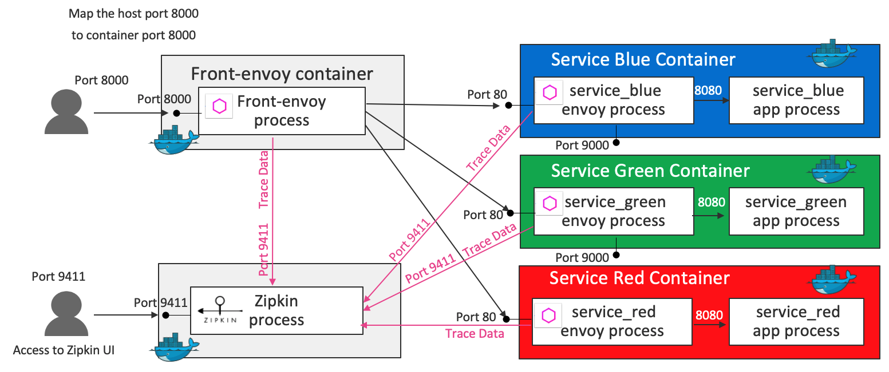
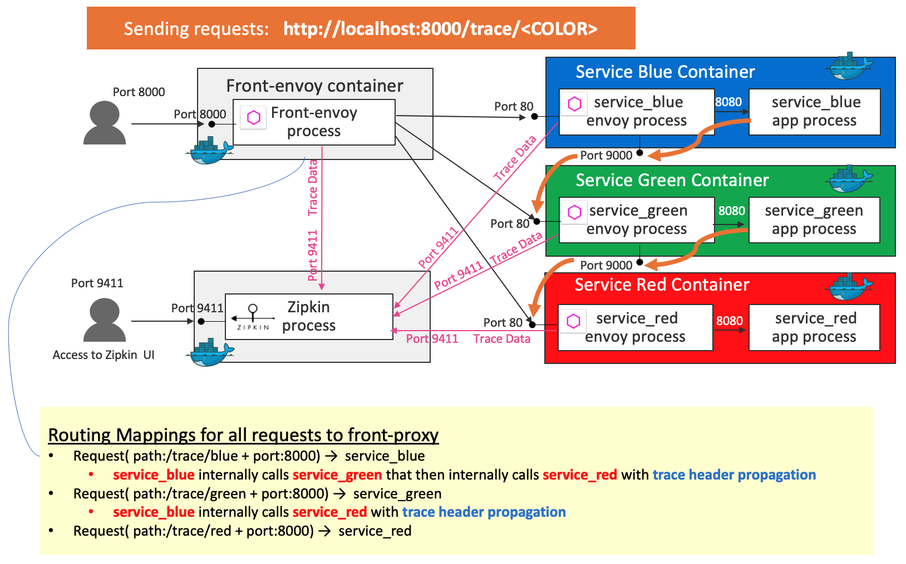
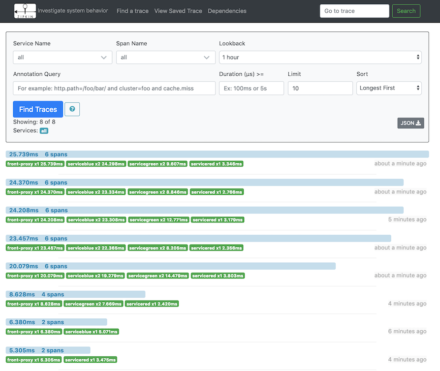

# Distributed Tracing: Zipkin Tracing

## Demo Overview
This is a Zipkin tracing example built based on the [Envoy sandboxes (Zipkin Tracing)](https://www.envoyproxy.io/docs/envoy/latest/start/sandboxes/zipkin_tracing) that demonstrates Envoy’s [tracing](https://www.envoyproxy.io/docs/envoy/latest/intro/arch_overview/observability/tracing) capabilities using [Zipkin](https://zipkin.io/) as the tracing provider.

All services in the demo support not only `service` endpoint (which is basically the same as [HTTP Routing: Simple Match Routing](../httproute-simple-match/README.md)) but also `trace` endpoint. All traffic is routed by the `front envoy` to the `service containers`. Internally the traffic is routed to the service envoys, then the service envoys route the request to the flask app via the loopback address. All trace data is collected into a `Zipkin` container.



### Endpoint - trace
In accessing to `trace` endpoint, all traffic is routed to the service envoys with trace header propagations like this:

- A request (path `/trace/blue` & port `8000`) is routed to `service_blue` 
  - `service_blue` internally calls `service_green` that then internally calls `service_red` with `trace header propagations`
- A request (path `/trace/green` & port `8000`) is routed to `service_green`
  - `service_blue` internally calls `service_red` with `trace header propagations`
- A request (path `/trace/red` & port `8000`) is routed to `service_red`



#### Key configuration 1: The HTTP connection manager 
All envoys are configured to collect request traces (e.g., [tracing](https://www.envoyproxy.io/docs/envoy/latest/api-v2/config/filter/network/http_connection_manager/v2/http_connection_manager.proto#envoy-api-msg-config-filter-network-http-connection-manager-v2-httpconnectionmanager-tracing) in config.filter.network.http_connection_manager.v2.HttpConnectionManager in front envoy).

```yaml
static_resources:
  listeners:
  - address:
      socket_address:
        address: 0.0.0.0
        port_value: 8000
    traffic_direction: OUTBOUND        
    filter_chains:
    - filters:
      - name: envoy.filters.network.http_connection_manager
        typed_config:
          "@type": type.googleapis.com/envoy.config.filter.network.http_connection_manager.v2.HttpConnectionManager
          generate_request_id: true
          tracing:
            provider:
              name: envoy.tracers.zipkin
              typed_config:
                "@type": type.googleapis.com/envoy.config.trace.v2.ZipkinConfig
                collector_cluster: zipkin
                collector_endpoint: "/api/v2/spans"
                collector_endpoint_version: HTTP_JSON
```

> - The HTTP connection manager that handles the request must have the tracing object set. Please refer to [tracing object](https://www.envoyproxy.io/docs/envoy/latest/api-v2/config/filter/network/http_connection_manager/v2/http_connection_manager.proto#envoy-api-msg-config-filter-network-http-connection-manager-v2-httpconnectionmanager-tracing).
> - For the configuration for an HTTP tracer provider used by Envoy, see [config.trace.v2.Tracing.Http](https://www.envoyproxy.io/docs/envoy/latest/api-v2/config/trace/v2/http_tracer.proto#envoy-api-msg-config-trace-v2-tracing-http)
>

> Presence of the object defines whether the connection manager emits tracing data to the configured tracing provider. You configure `tracing driver` in `name` field. Here are 4 parameter options for `tracing driver` and `envoy.tracers.zipkin` is selected here:
> - envoy.tracers.lightstep
> - envoy.tracers.zipkin
> - envoy.tracers.dynamic_ot
> - envoy.tracers.datadog
> - envoy.tracers.opencensus
> - envoy.tracers.xray
>
> Parameters for Config parts in zipkin deiver are [here](https://www.envoyproxy.io/docs/envoy/latest/api-v2/config/trace/v2/zipkin.proto#envoy-api-msg-config-trace-v2-zipkinconfig)

#### Key configuration 2: Spans propagation setup (Trace deiver setup)

All envoys in the demo are also configured to setup to propagate the spans generated by the Zipkin tracer to a Zipkin cluster.

```YAML
static_resources:
  listeners:
  ...
  - address:
      socket_address:
        address: 0.0.0.0
        port_value: 9000
    traffic_direction: OUTBOUND
    filter_chains:
    - filters:
      - name: envoy.filters.network.http_connection_manager
        typed_config:
          "@type": type.googleapis.com/envoy.config.filter.network.http_connection_manager.v2.HttpConnectionManager
          tracing:
            provider:
              name: envoy.tracers.zipkin
              typed_config:
                "@type": type.googleapis.com/envoy.config.trace.v2.ZipkinConfig
                collector_cluster: jaeger
                collector_endpoint: "/api/v2/spans"
                shared_span_context: false
                collector_endpoint_version: HTTP_JSON
...
  clusters:
  ...
  - name: zipkin
    connect_timeout: 1s
    type: strict_dns
    lb_policy: round_robin
    load_assignment:
      cluster_name: zipkin
      endpoints:
      - lb_endpoints:
        - endpoint:
            address:
              socket_address:
                address: zipkin
                port_value: 9411
```

#### Key configuration 3: Trace header propagation
One of the most important benefits of tracing from Envoy is that it will take care of propagating the traces to the Zipkin service cluster. However, in order to fully take advantage of tracing, the application has to propagate trace headers that Envoy generates. The sample `trace header propagations` setup in servcie application code ([apps/service.py](../apps/service.py)) is this:

```python
# ...omit...

TRACE_HEADERS_TO_PROPAGATE = [
    'X-Ot-Span-Context',
    'X-Request-Id',

    # Zipkin headers
    'X-B3-TraceId',
    'X-B3-SpanId',
    'X-B3-ParentSpanId',
    'X-B3-Sampled',
    'X-B3-Flags',

    # Jaeger header (for native client)
    "uber-trace-id"
]

def render_page():
    return ('<body bgcolor="{}"><span style="color:white;font-size:4em;">\n'
            'Hello from {} (hostname: {} resolvedhostname:{})\n</span></body>\n'.format(
                    os.environ['SERVICE_NAME'],
                    os.environ['SERVICE_NAME'],
                    socket.gethostname(),
                    socket.gethostbyname(socket.gethostname())))

# ...omit...

@app.route('/trace/<service_color>')
def trace(service_color):
    headers = {}
    ## For Propagation test ##
    # Call service 'green' from service 'blue'
    if (os.environ['SERVICE_NAME']) == 'blue':
        for header in TRACE_HEADERS_TO_PROPAGATE:
            if header in request.headers:
                headers[header] = request.headers[header]
        ret = requests.get("http://localhost:9000/trace/green", headers=headers)
    # Call service 'red' from service 'green'
    elif (os.environ['SERVICE_NAME']) == 'green':
        for header in TRACE_HEADERS_TO_PROPAGATE:
            if header in request.headers:
                headers[header] = request.headers[header]
        ret = requests.get("http://localhost:9000/trace/red", headers=headers)
    return render_page()

if __name__ == "__main__":
    app.run(host='127.0.0.1', port=8080, debug=True)
```

>  **Zipkin tracer**
- When using the `Zipkin tracer`, Envoy relies on the service to propagate the `B3 HTTP headers` ( `x-b3-traceid, x-b3-spanid, x-b3-parentspanid, x-b3-sampled, and x-b3-flags`). The x-b3-sampled header can also be supplied by an external client to either enable or disable tracing for a particular request. In addition, the single b3 header propagation format is supported, which is a more compressed format. Please refer to [B3 Header](https://www.envoyproxy.io/docs/envoy/latest/configuration/http_conn_man/headers#config-http-conn-man-headers-b3) for the detail. 


## Getting Started
```sh
$ git clone https://github.com/yokawasa/envoy-proxy-demos.git
$ cd envoy-proxy-demos/zipkin-tracing
```
> [NOTICE] Before you run this demo, make sure that all demo containers in previous demo are stopped!

## Run the Demo

### Build and Run containers

```sh
docker-compose up --build -d

# check all services are up
docker-compose ps --service

front-envoy
service_blue
service_green
service_red
zipkin

# List containers
docker-compose ps

             Name                           Command               State                            Ports
---------------------------------------------------------------------------------------------------------------------------------
zipkin-tracing_front-envoy_1     /docker-entrypoint.sh /bin ...   Up                      10000/tcp, 0.0.0.0:8000->8000/tcp, 0.0.0.0:8001->8001/tcp
zipkin-tracing_service_blue_1    /bin/sh -c /usr/local/bin/ ...   Up                      10000/tcp, 80/tcp                                        
zipkin-tracing_service_green_1   /bin/sh -c /usr/local/bin/ ...   Up                      10000/tcp, 80/tcp                                        
zipkin-tracing_service_red_1     /bin/sh -c /usr/local/bin/ ...   Up                      10000/tcp, 80/tcp                                        
zipkin-tracing_zipkin_1          /bin/sh -c /zipkin/run.sh        Up (health: starting)   9410/tcp, 0.0.0.0:9411->9411/tcp  
```

### Access each services and check tracing results

Access the following 3 endpoints for tracing test.
```
curl -s -v http://localhost:8000/trace/blue
curl -s -v http://localhost:8000/trace/green
curl -s -v http://localhost:8000/trace/red
```

For example, when you access `/trace/blue`, you'll see the following output
```sh
curl -v http://localhost:8000/trace/blue

*   Trying ::1...
* TCP_NODELAY set
* Connected to localhost (::1) port 8000 (#0)
> GET /trace/blue HTTP/1.1
> Host: localhost:8000
> User-Agent: curl/7.54.0
> Accept: */*
>
< HTTP/1.1 200 OK
< content-type: text/html; charset=utf-8
< content-length: 147
< server: envoy
< date: Sun, 17 Feb 2019 17:27:50 GMT
< x-envoy-upstream-service-time: 23
<
<body bgcolor="blue"><span style="color:white;font-size:4em;">
Hello from blue (hostname: 7400d4d450cd resolvedhostname:172.22.0.3)
</span></body>
* Connection #0 to host localhost left intact
```

Trace data would automatically have been generated and pushed to Zipkin via Envoy. In this part, check the Zipkin UI to see how the Zipkin visualize all the trace data collected. Here is a Zipkin UI url:

```
open http://localhost:9411
```



You'll come up with Zipkin UI page like above, then search each traces. Here are example tracing results in Zipkin UI:


## Stop & Cleanup

```sh
docker-compose down --remove-orphans --rmi all
```

---
[Top](../README.md)
